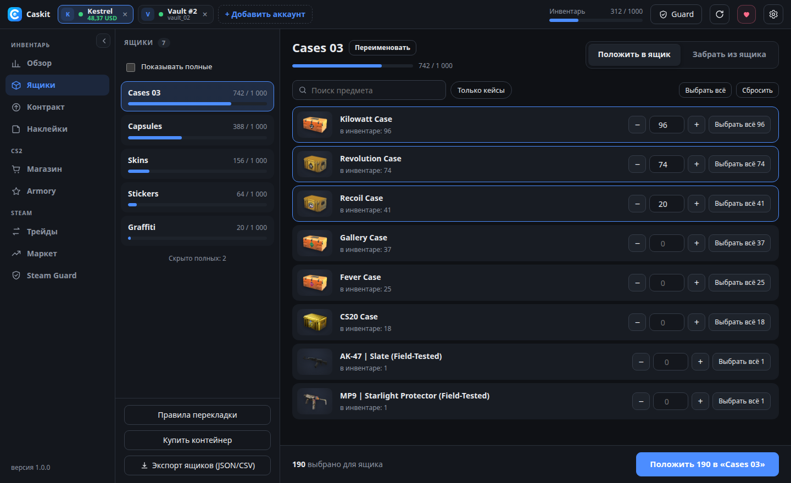
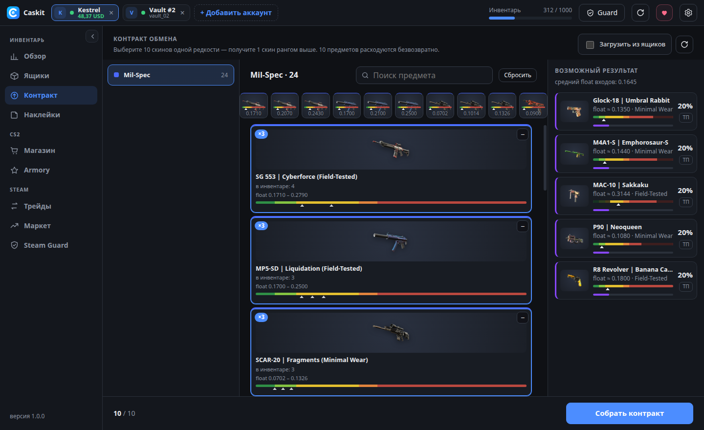
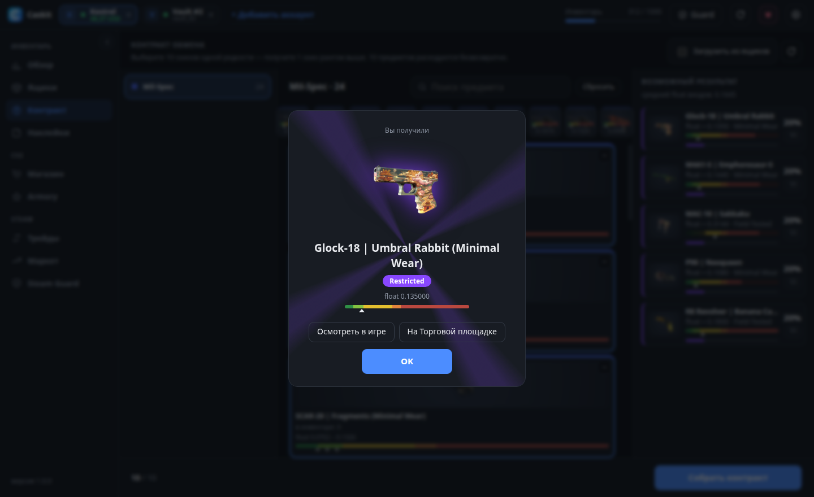
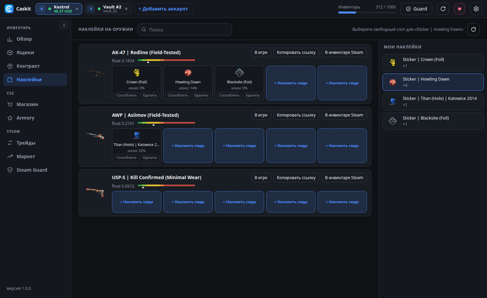
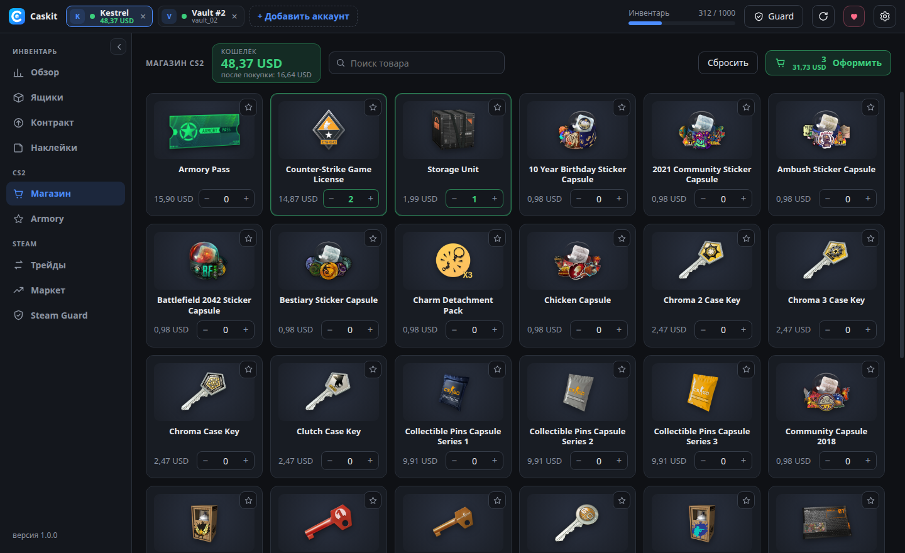
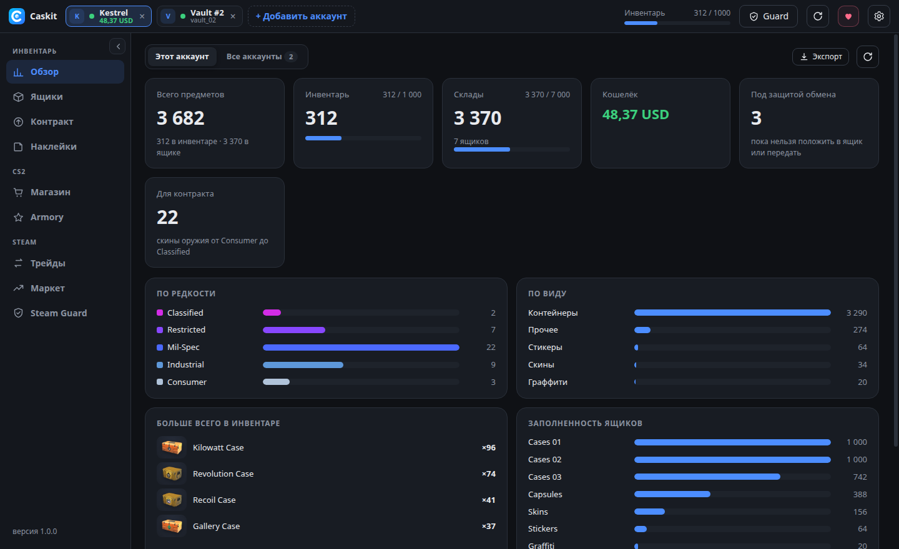
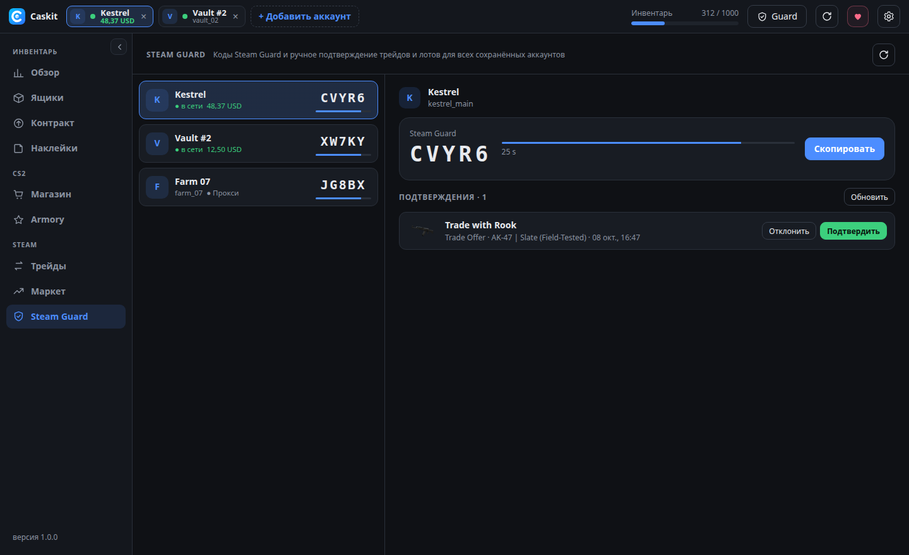

<p align="center"></p>

<h1 align="center">Caskit</h1>

<p align="center"><b>Бесплатный менеджер ящиков (Storage Unit) и инвентаря CS2 с открытым кодом.</b><br>
Быстрая перекладка, шансы контрактов, наклейки, магазин, маркет и Steam Guard — сразу для нескольких аккаунтов.<br>
Без подписок и сторонних серверов: всё работает на вашем компьютере и общается напрямую со Steam.</p>

<p align="center">
<a href="https://github.com/pythonMaster2002/cs2-storage-manager/releases/latest"></a>
<a href="https://github.com/pythonMaster2002/cs2-storage-manager/releases"></a>


<a href="https://ko-fi.com/mikidjus"></a>
</p>

<p align="center">
<a href="../README.md">English</a> ·
<b>Русский</b> ·
<a href="README.uk.md">Українська</a> ·
<a href="README.de.md">Deutsch</a> ·
<a href="README.es.md">Español</a> ·
<a href="README.pt.md">Português</a> ·
<a href="README.fr.md">Français</a> ·
<a href="README.pl.md">Polski</a> ·
<a href="README.tr.md">Türkçe</a> ·
<a href="README.zh.md">简体中文</a>
</p>

<p align="center"></p>

## Возможности

**Ящики (Storage Unit)**
- Массовая перекладка в ящики и обратно. Скорость подбирается сама под ограничения Steam (обычно 8–13 предметов/с), застрявшие предметы переотправляются автоматически.
- **Правила перекладки**: «все кейсы → Cases 01, Cases 02…», «наклейки → Stickers». По кнопке или сразу после входа.
- Переименование ящиков, скрытие полных, экспорт всего в JSON/CSV.

**Контракты обмена**
- Контракты из инвентаря *и* из ящиков (нужные предметы вынимаются сами).
- Все возможные исходы с **шансами**, float каждого входа и **прогноз float** результата на полосе износа.
- Предметы, которые игра не примет (самые редкие в своей коллекции), помечаются заранее. Сувениры поддерживаются.
- После крафта — **«Осмотреть в игре»** и **«На Торговой площадке»**.

**Наклейки**
- Наклеить, соскоблить и удалить — в том числе наклейки со свободным размещением CS2.
- Float оружия с полосой износа, износ наклеек, «осмотреть» и ссылка на предмет в инвентаре Steam.

**Магазин CS2 и Armory**
- Корзина, избранное, баланс кошелька и остаток после покупки. Каждую оплату подтверждаете вы.
- Armory: обмен звёзд на награды.
- Названия и картинки товаров обновляются сами из файлов игры.

**Трейды, Торговая площадка и Steam Guard**
- Входящие и исходящие обмены, принять/отклонить, автоприём подарков.
- Лоты, ордера на покупку, история с поиском, продажа с расчётом комиссии.
- Встроенный мини-**SDA**: коды Steam Guard для всех аккаунтов с maFile, подтверждения обменов и лотов, контроль прокси.

**Аккаунты и приватность**
- Несколько аккаунтов одновременно, у каждого свой SOCKS5/HTTP-прокси.
- Вход по **QR-коду** (появляется сразу), по логину и паролю или через **maFile**.
- 10 языков интерфейса, автообновления (версия с установщиком).

## Скриншоты

| | |
|---|---|
|  |  |
| **Контракт**: исходы, шансы, float | **Итог**: осмотреть в игре или открыть на ТП |
|  |  |
| **Наклейки**: наклеить, соскоблить, удалить | **Магазин CS2**: корзина и кошелёк |
|  |  |
| **Обзор** одного или всех аккаунтов | **Steam Guard**: коды и подтверждения |

## Скачать

Последняя версия — на странице **[Releases](https://github.com/pythonMaster2002/cs2-storage-manager/releases/latest)**.

| Система | Файл | |
|---|---|---|
| Windows | `Caskit-Setup-x.y.z.exe` | **рекомендуется** — ставится за пару секунд, без прав администратора, обновляется сам |
| Windows | `Caskit-x.y.z-portable.exe` | без установки (запускается медленнее, обновлять вручную) |
| macOS | `Caskit-x.y.z-arm64.dmg` (Apple Silicon) / `Caskit-x.y.z-x64.dmg` (Intel) | |
| Linux | `Caskit-x.y.z-x86_64.AppImage` или `Caskit-x.y.z-amd64.deb` | |

**Первый запуск.** Сборки пока без цифровой подписи, поэтому система может один раз предупредить:

- **Windows** («Windows защитила ваш компьютер»): **Подробнее → Выполнить в любом случае**.
- **macOS** («приложение повреждено» / «не удаётся проверить»): правый клик по приложению → **Открыть** или в Терминале `xattr -cr "/Applications/Caskit.app"`.
- **Linux AppImage**: `chmod +x Caskit-*.AppImage`, затем запустить.

## Безопасность и приватность

- Caskit общается только со Steam (и Game Coordinator CS2). Пароль не сохраняется; refresh token и секреты maFile хранятся у вас на диске **зашифрованными** средствами системы (Windows DPAPI / связка ключей macOS / libsecret в Linux).
- Если у аккаунта задан прокси, через него идёт *весь* трафик аккаунта — веб-запросы, QR-код, аватар. Если прокси не работает, вход прерывается, а не идёт напрямую.
- Локальный API слушает только `127.0.0.1` и требует случайный токен, известный лишь окну приложения.
- Названия и иконки предметов раз в сутки обновляются из публичных копий файлов игры ([GameTracking-CS2](https://github.com/SteamDatabase/GameTracking-CS2), [counter-strike-image-tracker](https://github.com/ByMykel/counter-strike-image-tracker)) — данные аккаунтов не отправляются.

## Вопросы

**Можно ли получить VAC-бан?** Caskit не трогает игру, её файлы и память и не запускает CS2. Он входит как клиент Steam и общается с Game Coordinator CS2 так же, как инвентарь самой игры, — VAC здесь не участвует. Но это неофициальный инструмент, используйте на свой риск.

**Можно ли играть, пока открыт Caskit?** Если запустить CS2 на том же аккаунте, Steam оставит только одну из двух сессий. Сначала выйдите из этого аккаунта в Caskit.

**Где хранятся данные?** Только на вашем компьютере: `%APPDATA%\Caskit` (Windows), `~/Library/Application Support/Caskit` (macOS), `~/.config/Caskit` (Linux).

## Поддержать проект

Caskit бесплатный и останется таким. Если он экономит вам время:

- ☕ [Ko-fi](https://ko-fi.com/mikidjus) — картой или PayPal
- 🎁 [Подарить скин](https://steamcommunity.com/tradeoffer/new/?partner=146040317&token=Q_pa1oMK) — любой лишний кейс или скин
- 💎 Крипта (Binance Pay / USDT) — адреса в приложении: кнопка ♥
- ⭐ Звезда репозиторию

## Сборка из исходников

Нужен Node.js 22+.

```bash
npm ci
npm start              # запуск
npm run build:win      # установщик + portable → dist/
npm run build:linux    # AppImage + deb
npm run build:mac      # dmg + zip (только на macOS)
```

**Релиз**: поднимите `version` в `package.json`, затем `git tag vX.Y.Z && git push --tags`. GitHub Actions соберёт все три системы и выложит их в Releases; установленные копии обновятся сами.

## Лицензия

[MIT](../LICENSE)

Caskit — независимый проект с открытым кодом. Не связан с Valve Corporation и не одобрен ею. Counter-Strike, CS2 и Steam — товарные знаки Valve Corporation.
