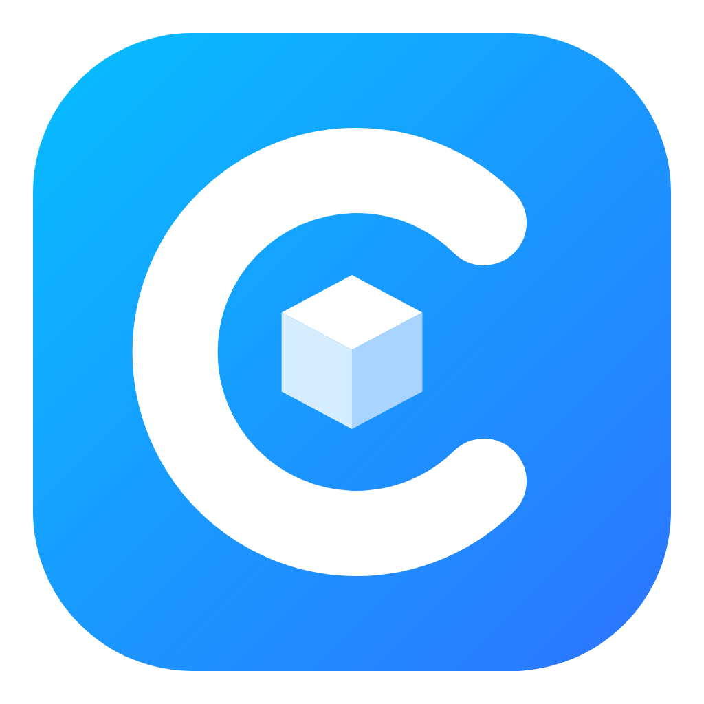
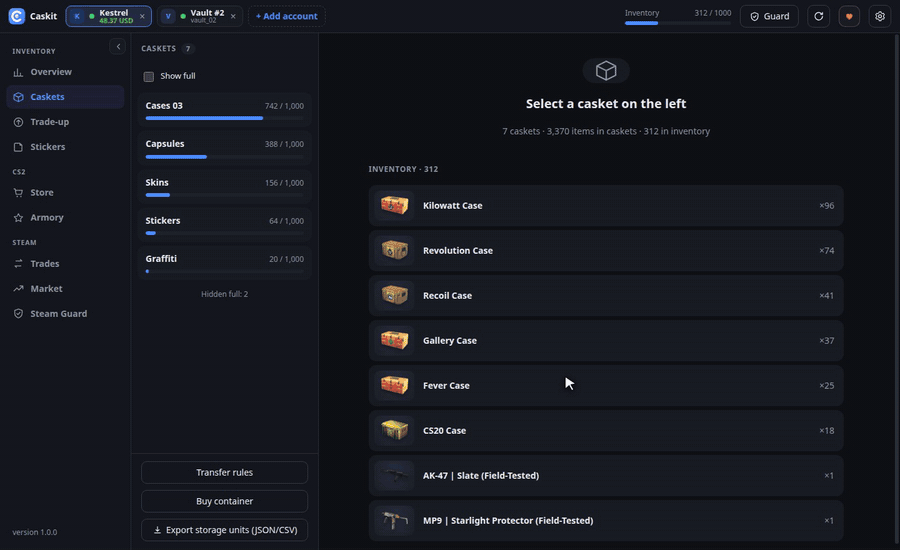
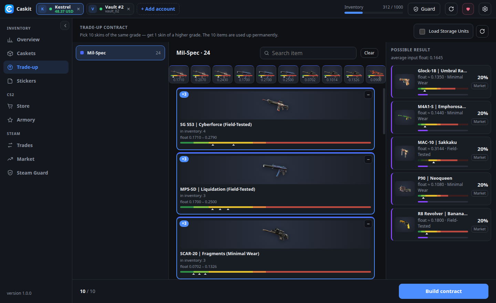
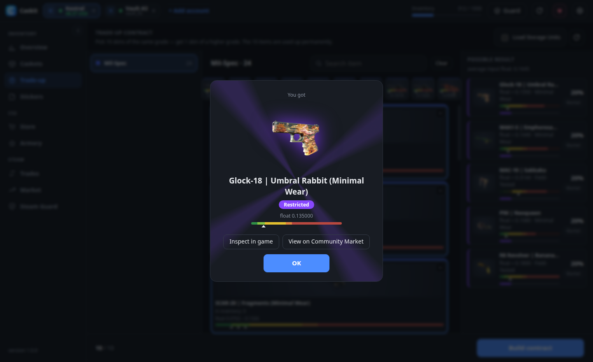
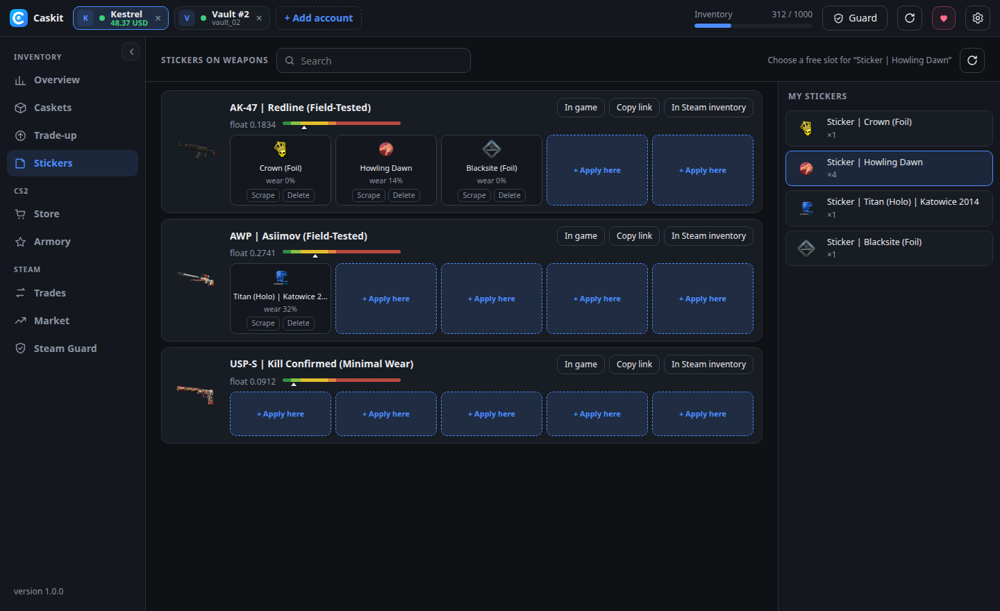
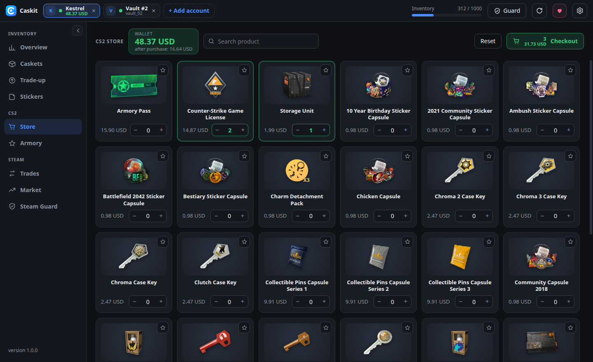
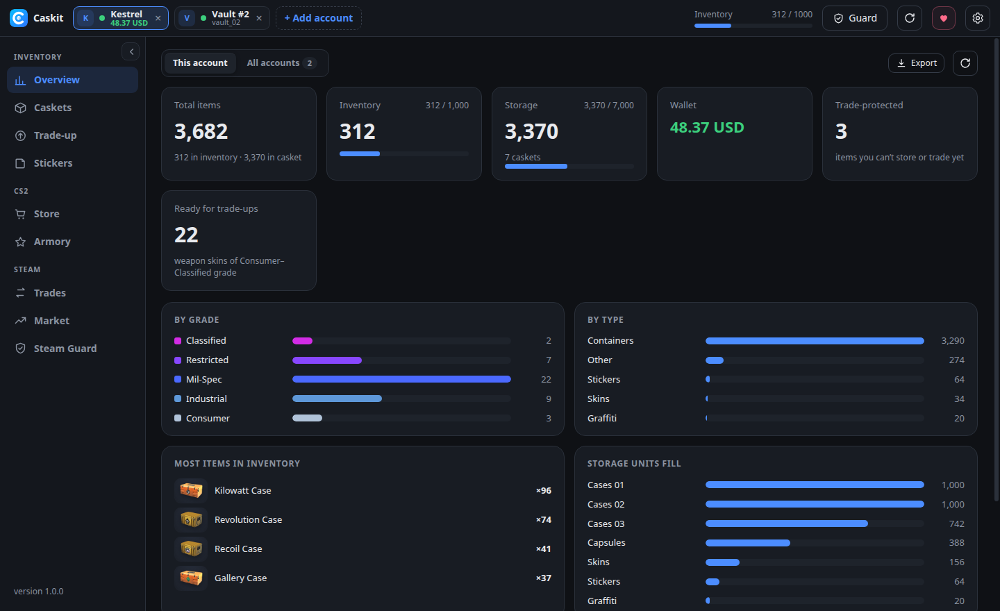
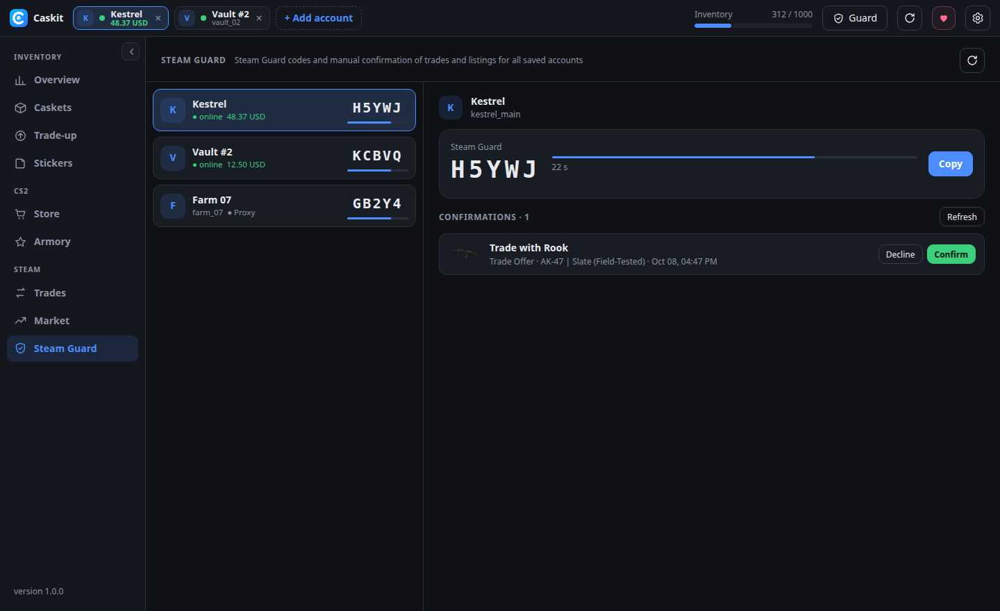

<p align="center"></p>

<h1 align="center">Caskit</h1>

<p align="center"><b>Безкоштовний менеджер сховищ (Storage Unit) та інвентаря CS2 з відкритим кодом.</b><br>
Швидке перекладання, шанси контрактів, наліпки, магазин, маркет і Steam Guard — одразу для кількох акаунтів.<br>
Без підписок і сторонніх серверів: усе працює на вашому комп’ютері й спілкується безпосередньо зі Steam.</p>

<p align="center">
<a href="https://github.com/pythonMaster2002/cs2-storage-manager/releases/latest"></a>
<a href="https://github.com/pythonMaster2002/cs2-storage-manager/releases"></a>


<a href="https://ko-fi.com/mikidjus"></a>
</p>

<p align="center">
<a href="../README.md">English</a> ·
<a href="README.ru.md">Русский</a> ·
<b>Українська</b> ·
<a href="README.de.md">Deutsch</a> ·
<a href="README.es.md">Español</a> ·
<a href="README.pt.md">Português</a> ·
<a href="README.fr.md">Français</a> ·
<a href="README.pl.md">Polski</a> ·
<a href="README.tr.md">Türkçe</a> ·
<a href="README.zh.md">简体中文</a>
</p>

<p align="center"></p>

> **Користувалися Casemove?** Автор припинив його підтримку заради Skinledger — «Casemove 2.0», платного сервісу: безкоштовна версія лише перекладає предмети, а швидке перекладання, покупки в магазині, контракти, Armory, більше акаунтів, обміни й маркет — за підпискою $9.99–24.99 на місяць ([FAQ Skinledger](https://skinledger.com/#frequently-asked-questions), [тарифи](https://skinledger.com/en/pricing-compare), жовтень 2026). Caskit робить усе це **безкоштовно**, без реєстрації на чужих сайтах — і з відкритим кодом.

## Можливості

**Сховища (Storage Unit)**
- Масове перекладання у сховища й назад. Швидкість підлаштовується під обмеження Steam (зазвичай 8–13 предметів/с), застряглі предмети надсилаються повторно автоматично.
- **Правила перекладання**: «усі кейси → Cases 01, Cases 02…», «наліпки → Stickers». Кнопкою або одразу після входу.
- Перейменування сховищ, приховування повних, експорт усього в JSON/CSV.

**Контракти обміну**
- Контракти з інвентаря *і* зі сховищ (потрібні предмети виймаються самі).
- Усі можливі результати з **шансами**, float кожного входу та **прогноз float** результату на смузі зносу.
- Предмети, які гра не прийме (найрідкісніші у своїй колекції), позначаються заздалегідь. Сувеніри підтримуються.
- Після крафту — **«Оглянути в грі»** і **«На Торговому майданчику»**.

**Наліпки**
- Наклеїти, зішкребти та видалити — зокрема наліпки з вільним розміщенням CS2.
- Float зброї зі смугою зносу, знос наліпок, «оглянути» та посилання на предмет в інвентарі Steam.

**Магазин CS2 та Armory**
- Кошик, обране, баланс гаманця та залишок після покупки. Кожну оплату підтверджуєте ви.
- Armory: обмін зірок на нагороди.
- Назви та зображення товарів оновлюються самі з файлів гри.

**Обміни, Торговий майданчик і Steam Guard**
- Вхідні та вихідні обміни, прийняти/відхилити, автоприйом подарунків.
- Лоти, ордери на купівлю, історія з пошуком, продаж із розрахунком комісії.
- Вбудований міні-**SDA**: коди Steam Guard для всіх акаунтів з maFile, підтвердження обмінів і лотів, контроль проксі.

**Акаунти й приватність**
- Кілька акаунтів одночасно, у кожного свій SOCKS5/HTTP-проксі.
- Вхід за **QR-кодом** (з’являється одразу), логіном і паролем або через **maFile**.
- 10 мов інтерфейсу, автооновлення (версія з інсталятором).

## Знімки екрана

| | |
|---|---|
|  |  |
| **Контракт**: результати, шанси, float | **Підсумок**: оглянути в грі або відкрити на ТМ |
|  |  |
| **Наліпки**: наклеїти, зішкребти, видалити | **Магазин CS2**: кошик і гаманець |
|  |  |
| **Огляд** одного або всіх акаунтів | **Steam Guard**: коди й підтвердження |

## Завантажити

Остання версія — на сторінці **[Releases](https://github.com/pythonMaster2002/cs2-storage-manager/releases/latest)**.

| Система | Файл | |
|---|---|---|
| Windows | `Caskit-Setup-x.y.z.exe` | **рекомендовано** — встановлюється за кілька секунд, без прав адміністратора, оновлюється сам |
| Windows | `Caskit-x.y.z-portable.exe` | без встановлення (запускається повільніше, оновлювати вручну) |
| macOS | `Caskit-x.y.z-arm64.dmg` (Apple Silicon) / `Caskit-x.y.z-x64.dmg` (Intel) | |
| Linux | `Caskit-x.y.z-x86_64.AppImage` або `Caskit-x.y.z-amd64.deb` | |

**Перший запуск.** Збірки поки без цифрового підпису, тож система може один раз попередити:

- **Windows** («Windows захистила ваш ПК»): **Докладніше → Усе одно запустити**.
- **macOS** («програму пошкоджено» / «неможливо перевірити»): правий клік по програмі → **Відкрити** або в Терміналі `xattr -cr "/Applications/Caskit.app"`.
- **Linux AppImage**: `chmod +x Caskit-*.AppImage`, потім запустити.

### Видалення

- **Windows (інсталятор)**: Параметри → Програми → **Caskit** → Видалити. **Portable**: просто видаліть `.exe`.
- **macOS**: перетягніть **Caskit** із «Програм» у Кошик.
- **Linux**: видаліть AppImage або `sudo apt remove caskit` для `.deb`.

Збережені входи й налаштування залишаються в папці даних (див. питання нижче) — видаліть і її, щоб стерти все.

## Безпека й приватність

- Caskit спілкується лише зі Steam (і Game Coordinator CS2). Пароль не зберігається; refresh token і секрети maFile зберігаються на вашому диску **зашифрованими** засобами системи (Windows DPAPI / зв’язка ключів macOS / libsecret у Linux).
- Якщо в акаунта задано проксі, через нього йде *весь* трафік акаунта — веб-запити, QR-код, аватар. Якщо проксі не працює, вхід переривається, а не йде напряму.
- Локальний API слухає лише `127.0.0.1` і вимагає випадковий токен, відомий тільки вікну програми.
- Назви та іконки предметів раз на добу оновлюються з публічних копій файлів гри ([GameTracking-CS2](https://github.com/SteamDatabase/GameTracking-CS2), [counter-strike-image-tracker](https://github.com/ByMykel/counter-strike-image-tracker)) — дані акаунтів не надсилаються.
- Без аналітики й телеметрії. Повний список мережевих підключень — у **[політиці конфіденційності](../PRIVACY.md)** (англ.).

## Питання

**Чи можна отримати VAC-бан?** Caskit не чіпає гру, її файли й пам’ять і не запускає CS2. Він входить як клієнт Steam і спілкується з Game Coordinator CS2 так само, як інвентар самої гри, — VAC тут не задіяний. Але це неофіційний інструмент, використовуйте на свій ризик.

**Чи можна грати, поки відкритий Caskit?** Якщо запустити CS2 на тому ж акаунті, Steam залишить лише одну з двох сесій. Спершу вийдіть із цього акаунта в Caskit.

**Де зберігаються дані?** Лише на вашому комп’ютері: `%APPDATA%\Caskit` (Windows), `~/Library/Application Support/Caskit` (macOS), `~/.config/Caskit` (Linux).

## Підтримати проєкт

Caskit безкоштовний і таким залишиться. Якщо він заощаджує вам час:

- ☕ [Ko-fi](https://ko-fi.com/mikidjus) — карткою або PayPal
- 🎁 [Подарувати скін](https://steamcommunity.com/tradeoffer/new/?partner=146040317&token=Q_pa1oMK) — будь-який зайвий кейс чи скін
- 💎 Крипта (Binance Pay / USDT) — адреси в програмі: кнопка ♥
- ⭐ Зірка репозиторію

## Збирання з вихідного коду

Потрібен Node.js 22+.

```bash
npm ci
npm start              # запуск
npm run build:win      # інсталятор + portable → dist/
npm run build:linux    # AppImage + deb
npm run build:mac      # dmg + zip (лише на macOS)
```

**Реліз**: підніміть `version` у `package.json`, потім `git tag vX.Y.Z && git push --tags`. GitHub Actions збере всі три системи й викладе їх у Releases; встановлені копії оновляться самі.

## Політика підпису коду

Збірки для Windows збираються з цього репозиторію в GitHub Actions; підпис — через SignPath (безкоштовно для відкритих проєктів, сертифікат SignPath Foundation). Докладніше — у розділі [Code signing policy](../README.md#code-signing-policy) (англ.).

## Ліцензія

[MIT](../LICENSE)

Caskit — незалежний проєкт із відкритим кодом. Не пов’язаний з Valve Corporation і не схвалений нею. Counter-Strike, CS2 і Steam — торговельні марки Valve Corporation.
