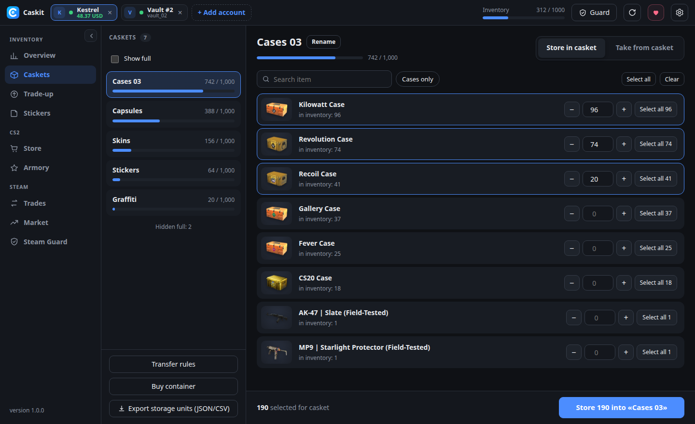

<p align="center"></p>

<h1 align="center">Caskit</h1>

<p align="center"><b>免费开源的 CS2 储物柜（Storage Unit）与库存管理器。</b><br>
快速转移、汰换合同概率、印花、商店、市场和 Steam 令牌——同时管理多个账户。<br>
无订阅、无第三方服务器：一切都在你的电脑上运行，直接与 Steam 通信。</p>

<p align="center">
<a href="https://github.com/pythonMaster2002/cs2-storage-manager/releases/latest"></a>
<a href="https://github.com/pythonMaster2002/cs2-storage-manager/releases"></a>


<a href="https://ko-fi.com/mikidjus"></a>
</p>

<p align="center">
<a href="../README.md">English</a> ·
<a href="README.ru.md">Русский</a> ·
<a href="README.uk.md">Українська</a> ·
<a href="README.de.md">Deutsch</a> ·
<a href="README.es.md">Español</a> ·
<a href="README.pt.md">Português</a> ·
<a href="README.fr.md">Français</a> ·
<a href="README.pl.md">Polski</a> ·
<a href="README.tr.md">Türkçe</a> ·
<b>简体中文</b>
</p>

<p align="center"></p>

## 功能

**储物柜（Storage Unit）**
- 批量存入和取出物品。速度会自动适应 Steam 的限制（通常每秒 8–13 件），卡住的物品会自动重试。
- **转移规则**：「所有箱子 → Cases 01、Cases 02…」、「印花 → Stickers」。一键执行或登录后自动执行。
- 重命名储物柜、隐藏已满的储物柜，并将全部内容导出为 JSON/CSV。

**汰换合同**
- 可使用库存*和*储物柜中的物品（会自动取出）。
- 显示所有可能结果及其**概率**、每件输入物品的磨损值，以及结果的**预计磨损值**（磨损条显示）。
- 游戏不接受的物品（所属收藏品的最高品质）会提前标出。支持纪念品。
- 合同完成后：**在游戏中检视**和**在社区市场查看**。

**印花**
- 贴上、刮擦和移除印花——包括 CS2 自由放置的印花。
- 武器磨损值与磨损条、印花磨损、检视链接，以及 Steam 库存中该物品的链接。

**CS2 商店与军械库**
- 购物车、收藏、钱包余额和购买后余额。每笔付款都由你确认。
- 军械库：用星星兑换奖励。
- 商品名称和图标会根据游戏文件自动更新。

**交易、社区市场与 Steam 令牌**
- 收到和发出的交易报价，接受/拒绝，自动接受礼物。
- 在售物品、求购订单、可搜索的历史记录、自动计算手续费的出售。
- 内置迷你 **SDA**：所有带 maFile 的账户的 Steam 令牌验证码、交易和上架确认、代理监控。

**账户与隐私**
- 同时登录多个账户，每个账户可使用自己的 SOCKS5/HTTP 代理。
- 使用**二维码**（立即显示）、用户名和密码或 **maFile** 登录。
- 10 种界面语言，自动更新（安装版）。

## 截图

| | |
|---|---|
|  |  |
| **汰换合同**：结果、概率、磨损 | **结果**：在游戏中检视或在市场中打开 |
|  |  |
| **印花**：贴上、刮擦、移除 | **CS2 商店**：购物车与钱包 |
|  |  |
| 单个或全部账户的**概览** | **Steam 令牌**：验证码与确认 |

## 下载

最新版本请见 **[Releases](https://github.com/pythonMaster2002/cs2-storage-manager/releases/latest)** 页面。

| 系统 | 文件 | |
|---|---|---|
| Windows | `Caskit-Setup-x.y.z.exe` | **推荐**——几秒完成安装，无需管理员权限，自动更新 |
| Windows | `Caskit-x.y.z-portable.exe` | 免安装（启动较慢，需手动更新） |
| macOS | `Caskit-x.y.z-arm64.dmg` (Apple Silicon) / `Caskit-x.y.z-x64.dmg` (Intel) | |
| Linux | `Caskit-x.y.z-x86_64.AppImage` 或 `Caskit-x.y.z-amd64.deb` | |

**首次启动。** 安装包尚未进行代码签名，系统可能会提示一次：

- **Windows**（「Windows 已保护你的电脑」）：点击 **更多信息 → 仍要运行**。
- **macOS**（「应用已损坏」/「无法验证」）：右键点击应用 → **打开**，或在终端执行 `xattr -cr "/Applications/Caskit.app"`。
- **Linux AppImage**：`chmod +x Caskit-*.AppImage`，然后运行。

## 安全与隐私

- Caskit 只与 Steam（以及 CS2 游戏协调器）通信。密码从不保存；refresh token 和 maFile 密钥由系统**加密**后保存在你的磁盘上（Windows DPAPI / macOS 钥匙串 / Linux libsecret）。
- 如果账户设置了代理，该账户的*全部*流量都经过代理——网页请求、二维码、头像。代理不可用时，登录会中止，而不会直接连接。
- 本地 API 只监听 `127.0.0.1`，并要求只有应用窗口知道的随机令牌。
- 物品名称和图标每天从游戏文件的公开镜像更新一次（[GameTracking-CS2](https://github.com/SteamDatabase/GameTracking-CS2)、[counter-strike-image-tracker](https://github.com/ByMykel/counter-strike-image-tracker)）——不会发送任何账户数据。

## 常见问题

**会被 VAC 封禁吗？** Caskit 不触碰游戏本身、游戏文件或内存，也不会启动 CS2。它以 Steam 客户端身份登录，像游戏自带的库存一样与 CS2 游戏协调器通信，VAC 不参与其中。但它仍是非官方工具，使用风险自负。

**Caskit 打开时可以玩游戏吗？** 如果在同一账户上启动 CS2，Steam 只会保留两个会话中的一个。请先在 Caskit 中退出该账户。

**数据保存在哪里？** 只在你的电脑上：`%APPDATA%\Caskit`（Windows）、`~/Library/Application Support/Caskit`（macOS）、`~/.config/Caskit`（Linux）。

## 支持项目

Caskit 永久免费。如果它为你节省了时间：

- ☕ [Ko-fi](https://ko-fi.com/mikidjus) — 银行卡或 PayPal
- 🎁 [赠送皮肤](https://steamcommunity.com/tradeoffer/new/?partner=146040317&token=Q_pa1oMK) — 任何多余的箱子或皮肤
- 💎 加密货币（Binance Pay / USDT）——地址见应用内 ♥ 按钮
- ⭐ 为仓库点亮星标

## 从源码构建

需要 Node.js 22+。

```bash
npm ci
npm start              # 运行
npm run build:win      # 安装包 + 便携版 → dist/
npm run build:linux    # AppImage + deb
npm run build:mac      # dmg + zip（仅限 macOS）
```

**发布**：在 `package.json` 中提升 `version`，然后执行 `git tag vX.Y.Z && git push --tags`。GitHub Actions 会构建三个系统的版本并发布到 Releases；已安装的副本会自动更新。

## 许可证

[MIT](../LICENSE)

Caskit 是独立的开源项目，与 Valve Corporation 无关，也未获其认可。Counter-Strike、CS2 和 Steam 是 Valve Corporation 的商标。
